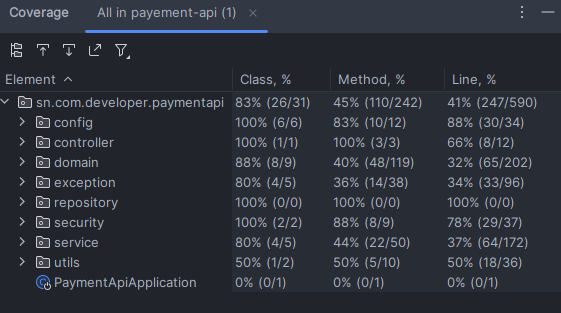

## 👤 Mamadou Lamine SENE

**Senior Java Developer**

- 📧 Email : [mamadoulaminesene30@gmail.com](mailto:mamadoulaminesene30@gmail.com)
- 🔗 LinkedIn : [linkedin.com/in/mamadoulaminesene](https://www.linkedin.com/in/mamadoulaminesene/)
- API_KEY Pour tester : SN_PAY_API_2025_4f7dA9B3C2E1G6HZQXRJYTWP
# 🏗️ Architecture API Payment - Java 17 - SPRING 3.3.13
#
## 📋 Vue d'ensemble
API RESTful pour gérer les paiements  avec les opérateurs sénégalais (ORANGE, EXPRESSO, YAS).

## 🏛️ Architecture en couches (Layered Architecture)

```
┌─────────────────────────────────────────────────────────────┐
│                    COUCHE PRÉSENTATION                      │
│  ┌─────────────┐  ┌─────────────┐  ┌─────────────┐          │
│  │ Controller  │  │   DTOs      │  │  Exception  │          │
│  │   REST      │  │  (Record)   │  │  Handlers   │          │
│  │             │  │ Request/    │  │             │          │
│  │             │  │ Response    │  │             │          │
│  └─────────────┘  └─────────────┘  └─────────────┘          │
└─────────────────────────────────────────────────────────────┘
                              │
┌─────────────────────────────────────────────────────────────┐
│                    COUCHE MÉTIER (Business)                 │
│  ┌─────────────┐  ┌────────────────────┐  ┌─────────────┐   │
│  │   Payment   │  │TransactionCallBack │  │ Transaction │   │
│  │   Service   │  │   Service          │  │  Generator  │   │
│  │             │  │                    │  │             │   │
│  └─────────────┘  └────────────────────┘  └─────────────┘   │
└─────────────────────────────────────────────────────────────┘
                              │
┌─────────────────────────────────────────────────────────────┐
│                    COUCHE DONNÉES                           │
│  ┌─────────────┐  ┌─────────────┐  ┌─────────────┐          │
│  │  JPA        │  │  Entity     │  │ Repository  │          │
│  │ Repository  │  │Transaction  │  │ Interfaces  │          │
│  │             │  │             │  │             │          │
│  └─────────────┘  └─────────────┘  └─────────────┘          │
└─────────────────────────────────────────────────────────────┘
                              │
┌─────────────────────────────────────────────────────────────┐
│                      BASE DE DONNÉES                        │
│                      PostgreSQL                             │
└─────────────────────────────────────────────────────────────┘
```

## 📁 Structure des packages

```
src/main/java/sn/com/developer/paymentapi/
├── 📁 config/                          # Contient toutes les configurations Spring Boot
│   ├── AsyncConfig.java               # Configure l'exécution des tâches asynchrones (ThreadPool)
│   ├── DataInitializer.java           # Initialise les données en base au démarrage (ex: opérateurs)
│   ├── PaymentProperties.java         # Mappe les propriétés personnalisées définies dans application.yml (clé API, callback)
│   └── RestTemplateConfig.java        # Expose un bean RestTemplate pour les appels HTTP externes
│
├── 📁 controller/                # Couche REST
│   ├── PaymentController.java    # Endpoint /envoi
│
├── 📁 domain/
│   ├── 📁 entity/                          # Entités JPA représentant les tables de la base
│   │   ├── Transaction.java               # Représente une transaction de paiement mobile
│   │   ├── Operateur.java                 # Représente un opérateur mobile (Orange, Expresso, Yas)
│   │   └── TransactionCallback.java       # Historique et statut des callbacks envoyés aux clients
│   │
│   └── 📁 enums/                           # Énumérations liées au métier
│       ├── OperateurEnum.java             # Enum des opérateurs (ORANGE, EXPRESSO, YAS)
│       ├── CallbackStatusEnum.java        # Enum des statuts de callback (SUCCESS, FAILED, PENDING, etc.)
│       └── TransactionStatusEnum.java     # Enum des statuts de transaction ( SUCCESS,FAILED,EXHAUSTED etc.) 
│ 
├── 📁 exception/                               # Gestion centralisée des erreurs et exceptions personnalisées
│   ├── BadRequestAlertException.java           # Exception métier levée en cas de requête invalide (400 Bad Request)
│   ├── CustomGlobalExceptionHandler.java       # Handler global pour intercepter et formater toutes les exceptions de l'API
│   └── ErrorResponse.java                      # DTO utilisé pour structurer les messages d'erreur retournés au client
│
├── 📁 repository/                               # Accès aux données via Spring Data JPA
│   ├── TransactionRepository.java               # Interface JPA pour la gestion des entités Transaction (CRUD)
│   ├── OperateurRepository.java                 # Interface JPA pour accéder aux opérateurs par code métier
│   └── TransactionCallbackRepository.java       # Interface JPA pour gérer l’historique des callbacks de transaction
│
├── 📁 security/                                # Configuration de la sécurité de l’API via API-KEY
│   ├── ApiKeyAuthFilter.java                   # Filtre personnalisé qui intercepte les requêtes et valide la clé API
│   └── SecurityConfig.java                     # Configuration Spring Security : endpoints publics, filtre, stratégie stateless
│
├── 📁 service/                                 # Logique métier de l'application (services, traitement des règles métier)
│   ├── 📁 dto/                                 # Objets de transfert de données utilisés entre couche web et métier
│   │   ├── PaymentRequest.java                 # Représente les données reçues pour initier un paiement (record)
│   │   └── PaymentResponse.java                # Représente la réponse envoyée après traitement d'un paiement (record)
│   ├── 📁 impl/                                # Implémentations concrètes des services métier
│   │   ├── PaymentServiceImpl.java             # Contient la logique métier pour initier un paiement mobile
│   │   └── TransactionCallbackServiceImpl.java # Gère l'envoi et la stratégie de retry des callbacks vers les clients
│   ├── PaymentService.java                     # Interface définissant le contrat du service de paiement
│   └── TransactionCallbackService.java         # Interface définissant le contrat du service de gestion des callbacks
│
├── 📁 utils/                                   # Classes utilitaires et fonctions génériques réutilisables
│   └── TransactionIdGenerator.java             # Génère des identifiants uniques pour les transactions (UUID ou logique personnalisée)
│
└── PaymentApiApplication.java    # Classe principale
```

## 🔄 Flux de traitement

### 1. Réception de la requête
```
POST /api/v1/envoi
Header: API-KEY: XXXXXXXXXX
Body: {
  "montant": 5000,
  "telephone": "771234567",
  "correlation_id": "CORR-2024-001",
  "operateur": "ORANGE",
  "callback_url": "https://httpbin.org/post"
}
```

## 🔁 Flux de Traitement d’un Paiement Mobile

Voici les différentes étapes exécutées lors de l’appel à l’endpoint `/api/v1/payment-api/envoi` :

---

### 1. ✅ Authentification
- Vérification de la validité de la clé `API-KEY` passée dans les headers HTTP.
- Si la clé est invalide ou absente → réponse `401 Unauthorized`.

---

### 2. 🔎 Validation des données
- Vérification des champs du `PaymentRequest` :
    - `montant` > 0
    - `telephone` au format attendu
    - `operateur` reconnu (ORANGE, EXPRESSO, YAS)
    - `correlation_id` non nul

---

### 3. 🚫 Détection de doublon
- Vérifie si le `correlation_id` a déjà été utilisé pour une transaction existante.
- Si oui → rejet avec `400 Bad Request`.

---

### 4. 🏗️ Création de la transaction
- Construction d’un objet `Transaction` avec :
    - Statut initial : `PENDING`
    - Identifiant unique (`transactionId`)
    - Données du client

---

### 5. 💾 Sauvegarde en base
- Persistance de la transaction en base via `TransactionRepository`.

---

### 6. 📤 Réponse immédiate
- Renvoi d’une réponse `PaymentResponse` au client avec :
    - Le `transactionId`
    - Le `status` : `PENDING`
    - Autres métadonnées

---

### 7. ⚙️ Traitement asynchrone
- En tâche de fond :
    - Simulation ou appel à l’API opérateur (Orange, Expresso, Yas)
    - Mise à jour du statut : `SUCCESS`, `FAILED`, etc.

---

### 8. 📡 Envoi du callback
- Si succès ou échec :
    - Envoi d’un `POST` vers le `callback_url` du client
    - Gestion des erreurs avec retry automatique (basé sur `maxRetries`)
    - Log de chaque tentative dans `TransactionCallback`

---


### 3. Réponse immédiate
```json
{
  "montant": 5000,
  "telephone": "771234567",
  "correlation_id": "CORR-2024-001",
  "transaction_id": "TXN-20240623-001",
  "status": "PENDING",
  "operateur": "ORANGE",
  "callback_url": "https://httpbin.org/post",
  "created_at": "2024-06-23T14:30:00"
}
```

## 🛠️ Technologies utilisées

- **Java 17** – Version LTS moderne
- **Spring Boot 3.2+** – Framework principal
- **Spring Data JPA** – Accès aux données relationnelles
- **PostgreSQL** – Base de données relationnelle
- **Spring Security** – Authentification par `API-KEY`
- **Spring Async** – Traitement asynchrone des paiements et callbacks
- **Bean Validation** – Validation des entrées avec `@Valid`
- **Swagger / OpenAPI** – Documentation interactive de l’API
- **Lombok** – Réduction du code boilerplate (constructeurs, getters, etc.)
- **SLF4J + Logback** – Logging centralisé
- **JUnit 5 / Mockito** – Tests unitaires et d’intégration
- **Jackson** – Sérialisation/désérialisation JSON
- **Maven** – Outil de build et de gestion des dépendances

## 🔒 Sécurité

1. ✅ **API Key Authentication** – Authentification sécurisée via le header `API-KEY`
2. ✅ **Validation stricte** – Tous les paramètres sont validés via `@Valid` et contraintes métiers
3. ✅ **Protection CSRF désactivée** – Adapté pour les APIs REST stateless
4. 🕒 **Rate Limiting** – Prévu à implémenter (Ex : Bucket4J, Redis, etc.)
5. ✅ **Logging sécurisé** – Aucune donnée sensible (clé API, téléphone complet, etc.) n’est logguée
6. 🔐 **Endpoints publics contrôlés** – Swagger et Actuator sont accessibles uniquement en environnement de développement

---

## 📊 Fonctionnalités avancées

- ✅ **Transactions atomiques** – ACID assuré via `@Transactional`
- ✅ **Traitement asynchrone** – Exécution non-bloquante avec `@Async` (paiement, notification)
- ✅ **Retry mechanism** – Relances automatiques des callbacks échoués (nombre et délai configurables)
- ✅ **Audit trail** – Historique des callbacks et status des transactions conservé
- ✅ **Gestion d'erreurs** – Centralisée avec messages clairs, cohérents et statuts HTTP appropriés
- ✅ **Documentation intégrée** – Swagger/OpenAPI 3 disponible à `/swagger-ui.html`
- ✅ **Monitoring** – Logs structurés et endpoints Actuator activés pour la supervision

---

## 🚀 Étapes de développement

1. 📦 **Configuration projet** – Initialisation Maven, Java 17, Spring Boot 3
2. 🧱 **Modèle de données** – Entités JPA et DTOs (`Transaction`, `PaymentRequest`, etc.)
3. 💾 **Repository Layer** – Interfaces `JpaRepository` pour persistance
4. ⚙️ **Service Layer** – Logique métier avec gestion des statuts et appels opérateur
5. 🌐 **Controller Layer** – Exposition de l’API REST (`/envoi`)
6. 🔒 **Sécurité** – Filtrage via `ApiKeyAuthFilter`, configuration `SecurityConfig`
7. 🧪 **Tests** – Tests unitaires (`@Service`), d’intégration (`@SpringBootTest`, `@Sql`)
8. 📝 **Documentation** – Swagger + `README.md` complet

---

### 📋 Prérequis

- **Pour le développement local :** Java 17, Maven, PostgreSQL
- **Pour Docker :** Docker et Docker Compose uniquement

### 🚀 Démarrage de l'application

Vous pouvez lancer cette API de deux façons selon votre environnement :

#### 1. Lancer en local avec le profil **dev**

Assurez-vous que le fichier de configuration `application-dev.yml` est bien configuré.

Dans le dossier racine du projet, lancez :

```bash
mvn spring-boot:run -Dspring-boot.run.profiles=dev
```

#### 2. Lancer avec Docker avec le profil **staging**

Assurez-vous que le fichier de configuration `application-staging.yml` est bien configuré.

**Première fois (avec build) :**
```bash
docker-compose up --build
```

**Lancements suivants :**
```bash
docker-compose up -d
```

**Voir les logs :**
```bash
docker-compose logs -f payment-api
```

**Arrêter les services :**
```bash
docker-compose down
```

> **Note :** Le profil `staging` sera automatiquement activé via la variable d'environnement `SPRING_PROFILES_ACTIVE=staging` dans le docker-compose.yml.

### 🛠️ Configuration

#### Profils disponibles

- **dev** : Développement local avec H2/PostgreSQL local
- **staging** : Environnement de test avec Docker

---

### TEST (Apres avoir démarré l'application)

## Table des matières
- [Installation](#installation)
- [Tests de l'API](#tests-de-lapi)
- [Gestion des erreurs](#gestion-des-erreurs)
- [Coverage des tests](#coverage-des-tests)

## Installation

```bash
mvn clean install
```

## Tests de l'API
API_kEY =  SN_PAY_API_2025_4f7dA9B3C2E1G6HZQXRJYTWP
### 1. Test de l'endpoint `/api/v1/payement-api/envoi`

Pour tester l'endpoint d'envoi de paiement :

**Exemple de requête :**
```json
{
  "montant": 5000,
  "telephone": "771234567",
  "correlationId": "CORR-2024-006",
  "operateur": "ORANGE",
  "callbackUrl": "https://httpbin.org/post"
}
```

**Réponse attendue :**
```json
{
  "montant": 5000,
  "telephone": "771234567",
  "correlationId": "CORR-2024-006",
  "transactionId": "ORANGE_pABfrx3GU",
  "status": "PENDING",
  "operateur": "ORANGE",
  "callbackUrl": "https://httpbin.org/post",
  "createdAt": "2025-06-26T12:22:00.3499471",
  "message": "Transaction initiée avec succès"
}
```

### 2. Callback avec réponse

Le système de callback fonctionne comme suit :

**Étapes du callback :**
1. L'API externe envoie une notification au callback URL
2. Notre système traite la réponse
3. Mise à jour du statut de la transaction

**Exemple de callback reçu :**
```
12:22:01.075 [payment-async-5] INFO  [] s.c.d.p.s.I.TransactionCallbackServiceImpl - Callback SUCCESS for transactionId=ORANGE_pABfrx3GU
```

## Gestion des erreurs

### 3. Exception pour correlationId existe deja

Quand le `correlationId` existe deja :
**Exemple de requête :**
```json
{
  "montant": 5000,
  "telephone": "771234567",
  "correlationId": "CORR-2024-006",
  "operateur": "ORANGE",
  "callbackUrl": "https://httpbin.org/post"
}
```


**Réponse d'erreur :**
```json
{
  "timestamp": "2025-06-26T12:25:30.172+00:00",
  "status": 400,
  "error": "Bad Request",
  "messages": [
    "Correlation CORR-2024-006 existe deja peut etre la transcaction est en pending faut patoenet"
  ],
  "path": "/api/v1/payment-api/envoi"
}
```

### 4. Opérateur inexistant

Quand l'opérateur spécifié n'existe pas dans le système :
**Exemple de requête :**
```json
{
  "montant": 5000,
  "telephone": "771234567",
  "correlationId": "CORR-2024-006",
  "operateur": "MTN",
  "callbackUrl": "https://httpbin.org/post"
}
```

**Réponse d'erreur :**
```json
{
  "timestamp": "2025-06-26T12:26:30.260+00:00",
  "status": 500,
  "error": "Internal Server Error",
  "messages": [
    "Une erreur est survenue"
  ],
  "path": "/api/v1/payment-api/envoi"
}
```

## Coverage des tests

### 5. Rapport de couverture après `mvn clean install`

Pour visualiser le coverage des tests après l'exécution de `mvn clean install` :

![Coverage report]

**Comment accéder au rapport de coverage :**

1. Exécuter les tests avec coverage :
```bash
mvn clean install
```

2. Le rapport est généré dans :
```
target/site/jacoco/index.html
```

3. Ouvrir le fichier dans votre navigateur :
```bash
# Sur Linux/Mac
open target/site/jacoco/index.html

# Sur Windows
start target/site/jacoco/index.html
```

**Métriques de coverage affichées :**
- **Instructions** : Pourcentage de lignes de code exécutées
- **Branches** : Pourcentage de branches conditionnelles testées
- **Lines** : Pourcentage de lignes de code couvertes
- **Methods** : Pourcentage de méthodes testées
- **Classes** : Pourcentage de classes testées


**Configuration Maven pour Jacoco :**
```xml
<plugin>
    <groupId>org.jacoco</groupId>
    <artifactId>jacoco-maven-plugin</artifactId>
    <version>0.8.8</version>
    <executions>
        <execution>
            <goals>
                <goal>prepare-agent</goal>
            </goals>
        </execution>
        <execution>
            <id>report</id>
            <phase>test</phase>
            <goals>
                <goal>report</goal>
            </goals>
        </execution>
    </executions>
</plugin>
```
